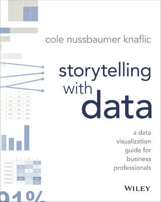

```{r setup, include=FALSE}
knitr::opts_chunk$set(echo = FALSE)

library(dplyr)
library(tidyr)
library(ggplot2)
library(grid)
library(gridExtra)
library(viridis)
library(scales)
library(knitr)

data <- read.csv("sampleData.csv")
data$Math8 <- factor(data$Math8,levels(data$Math8)[c(1,4,2,3)])

```

## Follow along
Resource|Link
---|---
 | <span style="font-size:160%;">https://cran.r-project.org </span>
 | <span style="font-size:160%;">https://www.rstudio.com </span>
 | <span style="font-size:120%;">https://github.com/JasonParker/slds2017</span>

## Do the work for me
I'd love to see your feedback, thoughts, and critiques of what we're discussing today.
<br><br>
<jason.parker@tn.gov>
<br><br><br>

<br>
@jasonparker83


## Effective data visualization

Six key takeaways

> - Understand the context
> - Choose appropriate visual display
> - Eliminate clutter
> - Focus attention
> - Think like a designer
> - Tell a story


## Simulated data set

We'll be using a simulated data set consisting of `r nrow(data)` observations. Here are the first few rows.

```{r simDataPreview, echo = FALSE}
head(data, 10, addrownums = FALSE)
```


## ACT composite scores - Too simple

Average ACT composite score = `r round(mean(data$ACT_composite),2)`

```{r tooSimple, echo = FALSE}
simpleData <- data %>%
  mutate(Type = "ACT") %>%
  group_by(Type) %>%
  summarize(Percent1_15 = round(sum(ACT_composite < 16)/n()*100,1),
            Percent16_20 = round(sum(ACT_composite %in% c(16:20))/n()*100,1),
            Percent21_26 = round(sum(ACT_composite %in% c(21:26))/n()*100,1),
            Percent27_36 = round(sum(ACT_composite %in% c(27:36))/n()*100,1)
            ) %>%
  gather(Category, Percentage, Percent1_15:Percent27_36) %>%
  arrange(Category) %>%
  mutate(position = cumsum(Percentage)-(Percentage/2))

simpleData$Category <- as.factor(simpleData$Category)
simpleData$Category = factor(simpleData$Category,levels(simpleData$Category)[c(4,3,2,1)])

ggplot(simpleData, aes(x = Type, y = Percentage, fill = Category)) +
  geom_bar(stat = "identity", width = .25) +
  geom_text(data = simpleData, aes(x = Type,
                                   y = position,
                                   label = paste(Percentage,"%", sep = ""))) +
  coord_flip() +
  scale_fill_viridis(discrete = TRUE, begin = .6,
                     guide = guide_legend(reverse=TRUE, title = "ACT score range"),
                     labels = c("27-36", "21-26", "16-20", "1-15")) +
  #ggtitle("ACT achievement by score range") +
  theme(
    text = element_text(size = 12),
    legend.position = "bottom",
    panel.grid = element_blank(),
    panel.background = element_blank(),
    plot.background = element_rect(fill = "transparent",colour = NA),
    plot.title = element_text(hjust = .5),
    axis.ticks = element_blank(),
    axis.title = element_blank(),
    axis.text = element_blank()
  )

```


## Distribution of ACT composite scores

```{r plot1busy, echo = FALSE}

ggplot(data, aes(x = ACT_composite, fill = viridis(1))) +
  geom_bar(stat = "count") +
  scale_fill_viridis(discrete=TRUE, begin = .6) +
  scale_x_continuous(breaks = pretty_breaks(9)) +
  scale_y_continuous(breaks = pretty_breaks(4)) +
  annotate("text", x = 26, y = 7500, hjust = 0, label = "Median = 19") +
  annotate("text", x = 26, y = 7000, hjust = 0, label = "Mean = 19") +
  annotate("text", x = 26, y = 6500, hjust = 0, label = "Standard deviation = 4.6") +
  xlab("ACT composite score") + ylab("Number of students") +
  theme(
    text = element_text(size = 12),
    legend.position = "none"
  )

```


## Distribution of ACT composite scores

```{r plot1ExtraBusy, echo = FALSE}

ggplot(data, aes(x = ACT_composite, fill = viridis(1))) +
  geom_bar(stat = "count") +
  scale_fill_viridis(discrete=TRUE, begin = .6) +
  scale_x_continuous(breaks = pretty_breaks(9)) +
  scale_y_continuous(breaks = pretty_breaks(4)) +
  geom_vline(xintercept = 20.5, size = 1) + 
  annotate("text", x = 21, y = 8500, hjust = 0, label = "ACT composite of 21") +
  annotate("text", x = 26, y = 7500, hjust = 0, label = "Median = 19") +
  annotate("text", x = 26, y = 7000, hjust = 0, label = "Mean = 19") +
  annotate("text", x = 26, y = 6500, hjust = 0, label = "Standard deviation = 4.6") +
  xlab("ACT composite score") + ylab("Number of students") +
  theme(
    text = element_text(size = 12),
    legend.position = "none"
  )

```


## Distribution of ACT composite scores

```{r plot1simple, echo = FALSE}

ggplot(data, aes(x = ACT_composite, fill = viridis(1))) +
  geom_bar(stat = "count") +
  scale_fill_viridis(discrete=TRUE, begin = .6) +
  scale_x_continuous(breaks = pretty_breaks(9)) +
  scale_y_continuous(breaks = pretty_breaks(4)) +
  geom_vline(xintercept = 20.5, size = 1) + 
  annotate("text", x = 21, y = 8500, hjust = 0, label = "ACT composite of 21") +
  xlab("ACT composite score") + ylab("Number of students") +
  theme(
    text = element_text(size = 12),
    panel.grid = element_blank(),
    panel.background = element_blank(),
    plot.background = element_rect(fill = "transparent",colour = NA),
    legend.position = "none",
    legend.title = element_blank(),
    axis.ticks = element_blank()
    #axis.title = element_blank()
  )

```

## Distribution of ACT composite scores

```{r plot1simpler, echo = FALSE}

ggplot(data, aes(x = ACT_composite, fill = viridis(1))) +
  geom_bar(stat = "count") +
  scale_fill_viridis(discrete=TRUE, begin = .6) +
  scale_x_continuous(breaks = pretty_breaks(9)) +
  scale_y_continuous(breaks = pretty_breaks(4)) +
  geom_vline(xintercept = 20.5, size = 1) + 
  annotate("text", x = 21, y = 8500, hjust = 0, label = "ACT composite of 21") +
  theme(
    text = element_text(size = 12),
    panel.grid = element_blank(),
    panel.background = element_blank(),
    plot.background = element_rect(fill = "transparent",colour = NA),
    legend.position = "none",
    legend.title = element_blank(),
    axis.ticks = element_blank(),
    axis.title = element_blank()
  )

```


## Distribution of ACT composite scores

```{r plot1evensimpler, echo = FALSE}

ggplot(data, aes(x = ACT_composite, fill = viridis(1))) +
  geom_bar(stat = "count") +
  scale_fill_viridis(discrete=TRUE, begin = .6) +
  scale_x_continuous(breaks = pretty_breaks(9)) +
  scale_y_continuous(breaks = pretty_breaks(4)) +
  geom_vline(xintercept = 20.5, size = 1) + 
  annotate("text", x = 21, y = 8500, hjust = 0, label = "ACT composite of 21") +
  theme(
    text = element_text(size = 12),
    panel.grid = element_blank(),
    panel.background = element_blank(),
    plot.background = element_rect(fill = "transparent",colour = NA),
    legend.position = "none",
    legend.title = element_blank(),
    axis.ticks = element_blank(),
    axis.title = element_blank(),
    axis.text = element_blank()
  )

```

## Distribution of ACT composite scores

```{r actBelow21, echo = FALSE, warning = FALSE, message = FALSE}

data2 <- data %>%
  mutate(color = ifelse(ACT_composite<21, "Below21", "Above21"))

ggplot(data2, aes(x = ACT_composite, fill = color)) +
  geom_bar(stat = "count") +
  annotate("text", label = "64.7% of students", x = 5, y = 8200, size = 5,
           hjust = 0, colour = "darkred") +
  annotate("text", label = "score below readiness", x = 5, y = 7800, size = 5,
           hjust = 0, colour = "darkred") + 
  annotate("text", label = "benchmark of 21.", x = 5, y = 7400, size = 5,
           hjust = 0, colour = "darkred") +
  scale_fill_manual(breaks = c("Above21", "Below21"),
                    values = c("darkgray", "darkred")) +
  scale_x_continuous(breaks = pretty_breaks(9)) +
  scale_y_continuous(breaks = pretty_breaks(4)) +
  geom_vline(xintercept = 20.5, size = 1) +
  annotate("text", x = 21, y = 8500, hjust = 0, label = "ACT composite of 21") +
  theme(
    text = element_text(size = 12),
    panel.grid = element_blank(),
    panel.background = element_blank(),
    plot.background = element_rect(fill = "transparent",colour = NA),
    legend.position = "none",
    legend.title = element_blank(),
    axis.ticks = element_blank(),
    axis.title = element_blank(),
    axis.text = element_blank()
  )

```


## Distribution of ACT composite scores

```{r actBelow21simpler, echo = FALSE, warning = FALSE, message = FALSE}

data2 <- data %>%
  mutate(color = ifelse(ACT_composite<21, "Below21", "Above21"))

ggplot(data2, aes(x = ACT_composite, fill = color)) +
  geom_bar(stat = "count") +
  annotate("text", label = "64.7% of students", x = 5, y = 8200, size = 5,
           hjust = 0, colour = "darkred") +
  annotate("text", label = "score below readiness", x = 5, y = 7800, size = 5,
           hjust = 0, colour = "darkred") + 
  annotate("text", label = "benchmark of 21.", x = 5, y = 7400, size = 5,
           hjust = 0, colour = "darkred") +
  scale_fill_manual(breaks = c("Above21", "Below21"),
                    values = c("darkgray", "darkred")) +
  scale_x_continuous(breaks = pretty_breaks(9)) +
  scale_y_continuous(breaks = pretty_breaks(4)) +
  theme(
    text = element_text(size = 12),
    panel.grid = element_blank(),
    panel.background = element_blank(),
    plot.background = element_rect(fill = "transparent",colour = NA),
    legend.position = "none",
    legend.title = element_blank(),
    axis.ticks = element_blank(),
    axis.title = element_blank(),
    axis.text = element_blank()
  )

```


## Distribution of ACT composite scores

```{r actAbove21, echo = FALSE, warning = FALSE, message = FALSE}

ggplot(data2, aes(x = ACT_composite, fill = color)) +
  geom_bar(stat = "count") +
  annotate("text", label = "35.3% of students meet", x = 24, y = 7000, size = 5,
           hjust = 0, colour = "navy") +
  annotate("text", label = "or exceed the readiness", x = 24, y = 6600, size = 5,
           hjust = 0, colour = "navy") + 
  annotate("text", label = "benchmark of 21.", x = 24, y = 6200, size = 5,
           hjust = 0, colour = "navy") +
  scale_fill_manual(breaks = c("Above21", "Below21"),
                    values = c("navy", "darkgray")) +
  scale_x_continuous(breaks = pretty_breaks(9)) +
  scale_y_continuous(breaks = pretty_breaks(4)) +
  theme(
    text = element_text(size = 12),
    panel.grid = element_blank(),
    panel.background = element_blank(),
    plot.background = element_rect(fill = "transparent",colour = NA),
    legend.position = "none",
    legend.title = element_blank(),
    axis.ticks = element_blank(),
    axis.title = element_blank(),
    axis.text = element_blank()
  )

```


## Distribution of ACT composite scores

```{r actOpportunity, echo = FALSE, warning = FALSE, message = FALSE}
data3 <- data %>%
  mutate(color = ifelse(ACT_composite %in% c(19,20), "NotWithin2", "Within2"))

ggplot(data3, aes(x = ACT_composite, fill = color)) +
  geom_bar(stat = "count") +
  annotate("text", label = "15.2% of students are", x = 5, y = 8200, size = 5,
           hjust = 0, colour = "forestgreen") +
  annotate("text", label = "within two points of ", x = 5, y = 7800, size = 5,
           hjust = 0, colour = "forestgreen") + 
  annotate("text", label = "meeting the readiness", x = 5, y = 7400, size = 5,
           hjust = 0, colour = "forestgreen") +
  annotate("text", label = "benchmark of 21.", x = 5, y = 7000, size = 5,
           hjust = 0, colour = "forestgreen") +
  scale_fill_manual(breaks = c("Within2", "NotWithin2"),
                    values = c("forestgreen", "darkgray")) +
  scale_x_continuous(breaks = pretty_breaks(9)) +
  scale_y_continuous(breaks = pretty_breaks(4)) +
  theme(
    text = element_text(size = 12),
    panel.grid = element_blank(),
    panel.background = element_blank(),
    plot.background = element_rect(fill = "transparent",colour = NA),
    legend.position = "none",
    legend.title = element_blank(),
    axis.ticks = element_blank(),
    axis.title = element_blank(),
    axis.text = element_blank()
  )

```


## ACT composite + Grade 8 math

```{r plot2, echo = FALSE}

ggplot(data, aes(x = ACT_composite, fill = Math8)) +
    geom_bar(stat = "count") +
  scale_x_continuous(breaks = pretty_breaks(9)) +
  scale_y_continuous(breaks = pretty_breaks(4)) +
  geom_vline(xintercept = 20.5, size = 1) +
  scale_fill_manual(breaks = c("Advanced", "Proficient", "Basic", "Below Basic"),
                    values = c(viridis(1, begin = .6),
                               viridis(1, begin = .7),
                               viridis(1, begin = .8),
                               viridis(1, begin = .99))) +
  annotate("text", x = 21, y = 8500, hjust = 0, label = "ACT composite of 21") +
  theme(
    text = element_text(size = 12),
    legend.position = "bottom",
    legend.title = element_blank()
  )

```

## ACT composite + Grade 8 math

```{r plot2busier, echo = FALSE}
stats <- data %>%
  group_by(Math8) %>%
  summarize(Median = median(ACT_composite),
            Mean = round(mean(ACT_composite),1),
            StDev = round(sd(ACT_composite),1))

ggplot(data, aes(x = ACT_composite, fill = Math8)) +
  geom_bar(stat = "count") +
  scale_fill_manual(breaks = c("Advanced", "Proficient", "Basic", "Below Basic"),
                    values = c(viridis(1, begin = .6),
                               viridis(1, begin = .7),
                               viridis(1, begin = .8),
                               viridis(1, begin = .99))) +
  scale_x_continuous(breaks = pretty_breaks(9)) +
  scale_y_continuous(breaks = pretty_breaks(4)) +
  geom_vline(xintercept = 20.5, size = 1) +
  annotate("text", x = 21, y = 8500, hjust = 0, label = "ACT composite of 21") +
  theme(
    text = element_text(size = 12),
    legend.position = "bottom",
    legend.title = element_blank()
  ) +
  annotation_custom(tableGrob(stats, rows = NULL, 
                              cols = c("Grade 8 Achievement", "Median", "Mean",
                                       "St. Dev."),
                              theme = ttheme_minimal(base_size = 8,
                                                     padding = unit(c(2,2), "mm"))), 
                    xmin=27, xmax=35, 
                    ymin=6200, ymax=7000)
```


## ACT composite + Grade 8 math

```{r plot2simpler, echo = FALSE}

ggplot(data, aes(x = ACT_composite, fill = Math8)) +
  geom_bar(stat = "count") +
  scale_fill_manual(breaks = c("Advanced", "Proficient", "Basic", "Below Basic"),
                    values = c(viridis(1, begin = .6),
                               viridis(1, begin = .7),
                               viridis(1, begin = .8),
                               viridis(1, begin = .99))) +
  scale_x_continuous(breaks = pretty_breaks(9)) +
  scale_y_continuous(breaks = pretty_breaks(4)) +
  geom_vline(xintercept = 20.5, size = 1) +
  annotate("text", x = 21, y = 8500, hjust = 0, label = "ACT composite of 21") +
  theme(
    text = element_text(size = 12),
    panel.grid = element_blank(),
    panel.background = element_blank(),
    plot.background = element_rect(fill = "transparent",colour = NA),
    legend.position = "bottom",
    legend.title = element_blank(),
    axis.ticks = element_blank(),
    axis.title = element_blank()
  )

```

## ACT composite for Grade 8 Advanced

```{r plot2advanced, echo = FALSE, message = FALSE, warning = FALSE}
dataAdvanced <- data %>%
  filter(Math8=="Advanced")

ggplot(dataAdvanced, aes(x = ACT_composite, fill = Math8)) +
  geom_bar(stat = "count") +
  scale_fill_viridis(discrete=TRUE, begin = .6) +
  scale_x_continuous(breaks = pretty_breaks(9), limits = c(5,36)) +
  scale_y_continuous(breaks = pretty_breaks(4)) +
  geom_vline(xintercept = 20.5, size = 1) +
  annotate("text", x = 21, y = 4000, hjust = 0, label = "ACT composite of 21") +
  theme(
    text = element_text(size = 12),
    panel.grid = element_blank(),
    panel.background = element_blank(),
    plot.background = element_rect(fill = "transparent",colour = NA),
    legend.position = "none",
    legend.title = element_blank(),
    axis.ticks = element_blank(),
    axis.title = element_blank()
  )

```

## ACT composite for Grade 8 Proficient

```{r plot2proficient, echo = FALSE}
dataProficient <- data %>%
  filter(Math8=="Proficient")

ggplot(dataProficient, aes(x = ACT_composite, fill = Math8)) +
  geom_bar(stat = "count") +
  scale_fill_viridis(discrete=TRUE, begin = .7) +
  scale_x_continuous(breaks = pretty_breaks(9), limits = c(5,36)) +
  scale_y_continuous(breaks = pretty_breaks(4)) +
  geom_vline(xintercept = 20.5, size = 1) +
  annotate("text", x = 21, y = 4300, hjust = 0, label = "ACT composite of 21") +
  theme(
    text = element_text(size = 12),
    panel.grid = element_blank(),
    panel.background = element_blank(),
    plot.background = element_rect(fill = "transparent",colour = NA),
    legend.position = "none",
    legend.title = element_blank(),
    axis.ticks = element_blank(),
    axis.title = element_blank()
  )

```

## ACT composite for Grade 8 Basic

```{r plot2basic, echo = FALSE}
dataBasic <- data %>%
  filter(Math8=="Basic")

ggplot(dataBasic , aes(x = ACT_composite, fill = Math8)) +
  geom_bar(stat = "count") +
  scale_fill_viridis(discrete=TRUE, begin = .8) +
  scale_x_continuous(breaks = pretty_breaks(9), limits = c(5,36)) +
  scale_y_continuous(breaks = pretty_breaks(4)) +
  geom_vline(xintercept = 20.5, size = 1) +
  annotate("text", x = 21, y = 3000, hjust = 0, label = "ACT composite of 21") +
  theme(
    text = element_text(size = 12),
    panel.grid = element_blank(),
    panel.background = element_blank(),
    plot.background = element_rect(fill = "transparent",colour = NA),
    legend.position = "none",
    legend.title = element_blank(),
    axis.ticks = element_blank(),
    axis.title = element_blank()
  )

```

## ACT composite for Grade 8 Below Basic

```{r plot2belowbasic, echo = FALSE}
dataBelowBasic <- data %>%
  filter(Math8=="Below Basic")

ggplot(dataBelowBasic , aes(x = ACT_composite, fill = Math8)) +
  geom_bar(stat = "count") +
  scale_fill_viridis(discrete=TRUE, begin = .99) +
  scale_x_continuous(breaks = pretty_breaks(9), limits = c(5,36)) +
  scale_y_continuous(breaks = pretty_breaks(4)) +
  geom_vline(xintercept = 20.5, size = 1) +
  annotate("text", x = 21, y = 1500, hjust = 0, label = "ACT composite of 21") +
  theme(
    text = element_text(size = 12),
    panel.grid = element_blank(),
    panel.background = element_blank(),
    plot.background = element_rect(fill = "transparent",colour = NA),
    legend.position = "none",
    legend.title = element_blank(),
    axis.ticks = element_blank(),
    axis.title = element_blank()
  )

```

## ACT composite for Grade 8 Below Basic

```{r plot2belowbasicScaled, echo = FALSE}
ggplot(dataBelowBasic , aes(x = ACT_composite, fill = Math8)) +
  geom_bar(stat = "count") +
  scale_fill_viridis(discrete=TRUE, begin = .99) +
  scale_x_continuous(breaks = pretty_breaks(9), limits = c(5,36)) +
  scale_y_continuous(breaks = pretty_breaks(4)) +
  geom_vline(xintercept = 20.5, size = 1) +
  annotate("text", x = 21, y = 4000, hjust = 0, label = "ACT composite of 21") +
  theme(
    text = element_text(size = 12),
    panel.grid = element_blank(),
    panel.background = element_blank(),
    plot.background = element_rect(fill = "transparent",colour = NA),
    legend.position = "none",
    legend.title = element_blank(),
    axis.ticks = element_blank(),
    axis.title = element_blank()
  )

```

## ACT composite + Grade 8 math

```{r plot2simplerAgain, echo = FALSE}

ggplot(data, aes(x = ACT_composite, fill = Math8)) +
  geom_bar(stat = "count") +
  scale_fill_manual(breaks = c("Advanced", "Proficient", "Basic", "Below Basic"),
                    values = c(viridis(1, begin = .6),
                               viridis(1, begin = .7),
                               viridis(1, begin = .8),
                               viridis(1, begin = .99))) +
  scale_x_continuous(breaks = pretty_breaks(9)) +
  scale_y_continuous(breaks = pretty_breaks(4)) +
  geom_vline(xintercept = 20.5, size = 1) +
  annotate("text", x = 21, y = 8500, hjust = 0, label = "ACT composite of 21") +
  theme(
    text = element_text(size = 12),
    panel.grid = element_blank(),
    panel.background = element_blank(),
    plot.background = element_rect(fill = "transparent",colour = NA),
    legend.position = "bottom",
    legend.title = element_blank(),
    axis.ticks = element_blank(),
    axis.title = element_blank()
  )

```


##  ACT composite + Grade 8 math

```{r plot2facets, echo = FALSE}

ggplot(data, aes(x = ACT_composite, fill = Math8)) +
  geom_bar(stat = "count") +
  facet_wrap(~ Math8) +
  scale_fill_manual(breaks = c("Advanced", "Proficient", "Basic", "Below Basic"),
                    values = c(viridis(1, begin = .6),
                               viridis(1, begin = .7),
                               viridis(1, begin = .8),
                               viridis(1, begin = .99))) +
  #scale_fill_viridis(discrete=TRUE, begin = .6) +
  scale_x_continuous(breaks = pretty_breaks(9)) +
  scale_y_continuous(breaks = pretty_breaks(4)) +
  geom_vline(xintercept = 20.5, size = .5) + 
  theme(
    text = element_text(size = 12),
    panel.grid = element_blank(),
    panel.background = element_blank(),
    plot.background = element_rect(fill = "transparent",colour = NA),
    legend.position = "bottom",
    legend.title = element_blank(),
    axis.ticks = element_blank(),
    axis.title = element_blank(),
    strip.text.x = element_text(size=8, face="bold", hjust = .2),
    strip.background = element_rect(fill="transparent", color = NA)
  )

```


##  ACT composite + Grade 8 math

```{r plot2facetsSimpler, echo = FALSE}

ggplot(data, aes(x = ACT_composite, fill = Math8)) +
  geom_bar(stat = "count") +
  facet_wrap(~ Math8) +
  scale_fill_manual(breaks = c("Advanced", "Proficient", "Basic", "Below Basic"),
                    values = c(viridis(1, begin = .6),
                               viridis(1, begin = .7),
                               viridis(1, begin = .8),
                               viridis(1, begin = .99))) +
  #scale_fill_viridis(discrete=TRUE, begin = .6) +
  scale_x_continuous(breaks = pretty_breaks(9)) +
  scale_y_continuous(breaks = pretty_breaks(4)) +
  geom_vline(xintercept = 20.5, size = .5) + 
  theme(
    text = element_text(size = 12),
    panel.grid = element_blank(),
    panel.background = element_blank(),
    plot.background = element_rect(fill = "transparent",colour = NA),
    legend.position = "none",
    legend.title = element_blank(),
    axis.ticks = element_blank(),
    axis.title = element_blank(),
    axis.text = element_blank(),
    strip.text.x = element_text(size=8, face="bold", hjust = .2),
    strip.background = element_rect(fill="transparent", color = NA)
  )

```

## ACT composite + Grade 8 math

```{r plot2simplerThirdTime, echo = FALSE}

ggplot(data, aes(x = ACT_composite, fill = Math8)) +
  geom_bar(stat = "count") +
  scale_fill_manual(breaks = c("Advanced", "Proficient", "Basic", "Below Basic"),
                    values = c(viridis(1, begin = .6),
                               viridis(1, begin = .7),
                               viridis(1, begin = .8),
                               viridis(1, begin = .99))) +
  scale_x_continuous(breaks = pretty_breaks(9)) +
  scale_y_continuous(breaks = pretty_breaks(4)) +
  geom_vline(xintercept = 20.5, size = 1) +
  annotate("text", x = 21, y = 8500, hjust = 0, label = "ACT composite of 21") +
  theme(
    text = element_text(size = 12),
    panel.grid = element_blank(),
    panel.background = element_blank(),
    plot.background = element_rect(fill = "transparent",colour = NA),
    legend.position = "bottom",
    legend.title = element_blank(),
    axis.ticks = element_blank(),
    axis.title = element_blank()
  )

```


## ACT composite + Grade 8 math

```{r plot2above21, echo = FALSE}

data4 <- data %>%
  mutate(color= "noHighlight")
data4$color[data4$ACT_composite > 20 & data4$Math8 == "Advanced"] <- "Above21advanced"
data4$color[data4$ACT_composite > 20 & data4$Math8 == "Proficient"] <- "Above21proficient"

ggplot(data4, aes(x = ACT_composite, fill = color)) +
  geom_bar(stat = "count") +
  scale_fill_manual(breaks = c("Above21advanced", "Above21proficient"),
                    labels = c("Advanced", "Proficient"),
                    values = c("blue4", "cadetblue1", "darkgray")) +
  scale_x_continuous(breaks = pretty_breaks(9)) +
  scale_y_continuous(breaks = pretty_breaks(4)) +
  annotate("text", label = "97.2% of students meeting", x = 23, y = 7300, size = 5,
           hjust = 0, colour = "blue4") +
  annotate("text", label = "the ACT readiness benchmark", x = 23, y = 6800, size = 5,
           hjust = 0, colour = "blue4") + 
  annotate("text", label = "earned Advanced or Proficient", x = 23, y = 6300, size = 5,
           hjust = 0, colour = "blue4") +
  annotate("text", label = "on Grade 8 math.", x = 23, y = 5800, size = 5,
           hjust = 0, colour = "blue4") +
  theme(
    text = element_text(size = 12),
    panel.grid = element_blank(),
    panel.background = element_blank(),
    plot.background = element_rect(fill = "transparent",colour = NA),
    legend.position = "bottom",
    legend.title = element_blank(),
    axis.ticks = element_blank(),
    axis.title = element_blank()
  )

```

## ACT composite + Grade 8 math

```{r plot2below21, echo = FALSE}

data5 <- data %>%
  mutate(color= "noHighlight")
data5$color[data5$ACT_composite < 21 & data5$Math8 == "Advanced"] <- "Below21Advanced"
data5$color[data5$ACT_composite < 21 & data5$Math8 == "Proficient"] <- "Below21Proficient"

ggplot(data5, aes(x = ACT_composite, fill = color)) +
  geom_bar(stat = "count") +
  scale_fill_manual(breaks = c("Below21Advanced", "Below21Proficient"),
                    labels = c("Advanced", "Proficient"),
                    values = c("darkred", "firebrick", "darkgray")) +
  scale_x_continuous(breaks = pretty_breaks(9)) +
  scale_y_continuous(breaks = pretty_breaks(4)) +
  annotate("text", label = "51.5% of students earning", x = 23, y = 7300, size = 5,
           hjust = 0, colour = "darkred") +
  annotate("text", label = "Advanced or Proficient on ", x = 23, y = 6800, size = 5,
           hjust = 0, colour = "darkred") + 
  annotate("text", label = "Grade 8 math do not meet", x = 23, y = 6300, size = 5,
           hjust = 0, colour = "darkred") +
  annotate("text", label = "the ACT readiness benchmark.", x = 23, y = 5800, size = 5,
           hjust = 0, colour = "darkred") +
  theme(
    text = element_text(size = 12),
    panel.grid = element_blank(),
    panel.background = element_blank(),
    plot.background = element_rect(fill = "transparent",colour = NA),
    legend.position = "bottom",
    legend.title = element_blank(),
    axis.ticks = element_blank(),
    axis.title = element_blank()
  )

```

## ACT composite + Grade 8 math

```{r plot2above21basics, echo = FALSE}

data6 <- data %>%
  mutate(color = "noHighlight")
data6$color[data6$ACT_composite > 20 & data6$Math8 == "Basic"] <- "Above21basic"
data6$color[data6$ACT_composite > 20 & data6$Math8 == "Below Basic"] <- "Above21belowBasic"
data6 <- data6 %>%
  arrange(color)
data6$color <- as.factor(data6$color)
data6$color <- factor(data6$color,levels(data6$color)[c(3,1,2)])

ggplot(data6, aes(x = ACT_composite, fill = color)) +
  geom_bar(stat = "count") +
  scale_fill_manual(breaks = c("Above21basic", "Above21belowBasic"),
                    labels = c("Basic", "Below Basic"),
                    values = c("darkgray", "green4", "green3")) +
  scale_x_continuous(breaks = pretty_breaks(9)) +
  scale_y_continuous(breaks = pretty_breaks(4)) +
  annotate("text", label = "3.3% of students earning", x = 24, y = 7000, size = 5,
           hjust = 0, colour = "green4") +
  annotate("text", label = "Basic or Below Basic on ", x = 24, y = 6500, size = 5,
           hjust = 0, colour = "green4") + 
  annotate("text", label = "Grade 8 math meet the", x = 24, y = 6000, size = 5,
           hjust = 0, colour = "green4") +
  annotate("text", label = "ACT readiness benchmark.", x = 24, y = 5500, size = 5,
           hjust = 0, colour = "green4") +
  theme(
    text = element_text(size = 12),
    panel.grid = element_blank(),
    panel.background = element_blank(),
    plot.background = element_rect(fill = "transparent",colour = NA),
    legend.position = "bottom",
    legend.title = element_blank(),
    axis.ticks = element_blank(),
    axis.title = element_blank()
  )

```

## ACT composite + Grade 8 math

```{r plot2below21basics, echo = FALSE}

data6 <- data %>%
  mutate(color = "noHighlight")
data6$color[data6$ACT_composite < 21 & data6$Math8 == "Basic"] <- "Below21basic"
data6$color[data6$ACT_composite < 21 & data6$Math8 == "Below Basic"] <- "Below21belowBasic"
data6 <- data6 %>%
  arrange(color)
data6$color <- as.factor(data6$color)
data6$color <- factor(data6$color,levels(data6$color)[c(3,1,2)])

ggplot(data6, aes(x = ACT_composite, fill = color)) +
  geom_bar(stat = "count") +
  scale_fill_manual(breaks = c("Below21basic", "Below21belowBasic"),
                    labels = c("Basic", "Below Basic"),
                    values = c("darkgray", "orangered4", "orangered")) +
  scale_x_continuous(breaks = pretty_breaks(9)) +
  scale_y_continuous(breaks = pretty_breaks(4)) +
  annotate("text", label = "44.3% of students scoring", x = 24, y = 7000, size = 5,
           hjust = 0, colour = "orangered4") +
  annotate("text", label = "below the ACT readiness", x = 24, y = 6500, size = 5,
           hjust = 0, colour = "orangered4") + 
  annotate("text", label = "benchmark earned Basic or", x = 24, y = 6000, size = 5,
           hjust = 0, colour = "orangered4") +
  annotate("text", label = "Below Basic in Grade 8 math.", x = 24, y = 5500, size = 5,
           hjust = 0, colour = "orangered4") +
  theme(
    text = element_text(size = 12),
    panel.grid = element_blank(),
    panel.background = element_blank(),
    plot.background = element_rect(fill = "transparent",colour = NA),
    legend.position = "bottom",
    legend.title = element_blank(),
    axis.ticks = element_blank(),
    axis.title = element_blank()
  )

```

## ACT composite + Grade 8 math
**Potential interpretations**

> - Significant downward mobility but virtually no upward mobility in achievement during high school.
> - Secondary math instruction adds little value.
> - Proficient on Grade 8 Math assessment is not adequately aligned with ACT readiness.
> - Grade 8 Math assessment is flawed.


## How do we add postsecondary?

```{r plot2FourthTime, echo = FALSE}

ggplot(data, aes(x = ACT_composite, fill = Math8)) +
  geom_bar(stat = "count") +
  scale_fill_manual(breaks = c("Advanced", "Proficient", "Basic", "Below Basic"),
                    values = c(viridis(1, begin = .6),
                               viridis(1, begin = .7),
                               viridis(1, begin = .8),
                               viridis(1, begin = .99))) +
  scale_x_continuous(breaks = pretty_breaks(9)) +
  scale_y_continuous(breaks = pretty_breaks(4)) +
  geom_vline(xintercept = 20.5, size = 1) +
  annotate("text", x = 21, y = 8500, hjust = 0, label = "ACT composite of 21") +
  theme(
    text = element_text(size = 12),
    panel.grid = element_blank(),
    panel.background = element_blank(),
    plot.background = element_rect(fill = "transparent",colour = NA),
    legend.position = "bottom",
    legend.title = element_blank(),
    axis.ticks = element_blank(),
    axis.title = element_blank()
  )

```

## ACT composite + Grade 8 math + PS

```{r plot3, echo = FALSE}

ggplot(data, aes(x = ACT_composite, fill = PSenrollment)) +
  geom_bar(stat = "count") +
  scale_fill_manual(breaks = c("Enrolled", "Did not enroll"),
                    values = c(viridis(1, begin = .2),
                               viridis(1, begin = .5))) +
  #scale_fill_viridis(discrete=TRUE, begin = .6) +
  scale_x_continuous(breaks = pretty_breaks(9)) +
  scale_y_continuous(breaks = pretty_breaks(4)) +
  geom_vline(xintercept = 20.5, size = 1) +
  annotate("text", x = 21, y = 8500, hjust = 0, label = "ACT composite of 21") +
  theme(
    text = element_text(size = 12),
    panel.grid = element_blank(),
    panel.background = element_blank(),
    plot.background = element_rect(fill = "transparent",colour = NA),
    legend.position = "bottom",
    legend.title = element_blank(),
    axis.ticks = element_blank(),
    axis.title = element_blank(),
    axis.text.y = element_blank(),
    strip.text.x = element_text(size=8, face="bold", hjust = .2),
    strip.background = element_rect(fill="transparent", color = NA)
  )

```

## ACT composite + Grade 8 math + PS

```{r plot3complicated, echo = FALSE}

dataComplicated <- data %>%
  mutate(color = paste(Math8, PSenrollment, sep = " "))
dataComplicated$color <- as.factor(dataComplicated$color)
dataComplicated$color <- factor(dataComplicated$color,levels(dataComplicated$color)[c(1,2,7,8,3,4,5,6)])

ggplot(dataComplicated, aes(x = ACT_composite, fill = color)) +
  geom_bar(stat = "count") +
  scale_fill_viridis(discrete=TRUE, begin = .1, end = .9, option = "inferno") +
  scale_x_continuous(breaks = pretty_breaks(9)) +
  scale_y_continuous(breaks = pretty_breaks(4)) +
  geom_vline(xintercept = 20.5, size = 1) +
  annotate("text", x = 21, y = 8500, hjust = 0, label = "ACT composite of 21") +
  theme(
    text = element_text(size = 12),
    panel.grid = element_blank(),
    panel.background = element_blank(),
    plot.background = element_rect(fill = "transparent",colour = NA),
    legend.position = "bottom",
    legend.title = element_blank(),
    axis.ticks = element_blank(),
    axis.title = element_blank(),
    axis.text.y = element_blank(),
    strip.text.x = element_text(size=8, face="bold", hjust = .2),
    strip.background = element_rect(fill="transparent", color = NA)
  )

```


## ACT composite + Grade 8 math + PS

```{r plot3facets, echo = FALSE}

ggplot(data, aes(x = ACT_composite, fill = Math8)) +
  geom_bar(stat = "count") +
  facet_grid(PSenrollment ~ Math8) +
  scale_fill_manual(breaks = c("Advanced", "Proficient", "Basic", "Below Basic"),
                    values = c(viridis(1, begin = .2, option = "inferno"),
                               viridis(1, begin = .4, option = "inferno"),
                               viridis(1, begin = .6, option = "inferno"),
                               viridis(1, begin = .8, option = "inferno"))) +
  #scale_fill_viridis(discrete=TRUE, begin = .6) +
  scale_x_continuous(breaks = pretty_breaks(9)) +
  scale_y_continuous(breaks = pretty_breaks(4)) +
  geom_vline(xintercept = 20.5, size = .5) + 
  theme(
    text = element_text(size = 12),
    panel.grid = element_blank(),
    panel.background = element_blank(),
    plot.background = element_rect(fill = "transparent",colour = NA),
    legend.position = "none",
    legend.title = element_blank(),
    axis.ticks = element_blank(),
    axis.title = element_blank(),
    axis.text.y = element_blank(),
    strip.text.x = element_text(size=8, face="bold", hjust = .2),
    strip.background = element_rect(fill="transparent", color = NA)
  )

```

## ACT composite + Grade 8 math + PS

```{r plot3facetsWayComplicated, echo = FALSE}

ggplot(data, aes(x = ACT_composite, fill = Math8)) +
  geom_bar(stat = "count") +
  facet_grid(PSenrollment ~ Math8) +
  scale_fill_manual(breaks = c("Advanced", "Proficient", "Basic", "Below Basic"),
                    values = c(viridis(1, begin = .2, option = "inferno"),
                               viridis(1, begin = .4, option = "inferno"),
                               viridis(1, begin = .6, option = "inferno"),
                               viridis(1, begin = .8, option = "inferno"))) +
  #scale_fill_viridis(discrete=TRUE, begin = .6) +
  scale_x_continuous(breaks = pretty_breaks(9)) +
  scale_y_continuous(breaks = pretty_breaks(4)) +
  geom_vline(xintercept = 20.5, size = .5) + 
  theme(
    text = element_text(size = 12),
    #panel.grid = element_blank(),
    #panel.background = element_blank(),
    #plot.background = element_rect(fill = "transparent",colour = NA),
    #legend.position = "none",
    #legend.title = element_blank(),
    #axis.ticks = element_blank(),
    #axis.title = element_blank(),
    #axis.text.y = element_blank(),
    strip.text.x = element_text(size=8, face="bold", hjust = .2),
    strip.background = element_rect(fill="transparent", color = NA)
  )

```


## ACT composite + Grade 8 math + PS

```{r plot3facetsBetter, echo = FALSE}

ggplot(data, aes(x = ACT_composite, fill = PSenrollment)) +
  geom_bar(stat = "count") +
  facet_wrap( ~ Math8) +
  scale_fill_viridis(discrete=TRUE, begin = .3, end = .7) +
  scale_x_continuous(breaks = pretty_breaks(9)) +
  scale_y_continuous(breaks = pretty_breaks(4)) +
  geom_vline(xintercept = 20.5, size = .5) + 
  theme(
    text = element_text(size = 12),
    panel.grid = element_blank(),
    panel.background = element_blank(),
    plot.background = element_rect(fill = "transparent",colour = NA),
    legend.position = "bottom",
    legend.title = element_blank(),
    axis.ticks = element_blank(),
    axis.title = element_blank(),
    axis.text.y = element_blank(),
    strip.text.x = element_text(size=8, face="bold", hjust = .2),
    strip.background = element_rect(fill="transparent", color = NA)
  )

```

## ACT composite + Grade 8 math + PS
<span style="font-size:70%; color:black">Across all Grade 8 Math achievement bands, 87.5% of students scoring 21+ on the ACT enrolled in postsecondary education.</span>

```{r plot3facetsStory1, echo = FALSE}
data31 <- data %>%
  mutate(color = ifelse(ACT_composite>20 & PSenrollment == "Enrolled", "Above21", "Below21"))
data31$color <- as.factor(data31$color)
data31$color <- factor(data31$color,levels(data31$color)[c(2,1)])
data311 <- data31 %>% 
  group_by(Math8) %>% 
  summarize(TwentyOnePS = sum(ACT_composite>20 & PSenrollment == "Enrolled"),
            TwentyOneNoPS = sum(ACT_composite>20 & PSenrollment == "Did not enroll"),
            Percentage = round(TwentyOnePS/sum(TwentyOnePS,TwentyOneNoPS)*100,1)) %>%
  mutate(annotation1= paste(Percentage,"% of", sep = ""),
         annotation2= "students enrolled")
         

ggplot(data31, aes(x = ACT_composite, fill = color)) +
  geom_bar(stat = "count") +
  facet_wrap( ~ Math8) +
  scale_fill_manual(breaks = c("Below21", "Above21"),
                    values = c("darkgray", "navy")) +
  scale_x_continuous(breaks = pretty_breaks(9)) +
  scale_y_continuous(breaks = pretty_breaks(4)) +
  annotate("text", label = data311$annotation1,
           x = 23, y = 5300, size = 4,
           hjust = 0, colour = "navy") +
  annotate("text", label = data311$annotation2,
           x = 23, y = 4600, size = 4,
           hjust = 0, colour = "navy") +
  theme(
    text = element_text(size = 12),
    panel.grid = element_blank(),
    panel.background = element_blank(),
    plot.background = element_rect(fill = "transparent",colour = NA),
    legend.position = "none",
    legend.title = element_blank(),
    axis.ticks = element_blank(),
    axis.title = element_blank(),
    axis.text.y = element_blank(),
    strip.text.x = element_text(size=8, face="bold", hjust = .2),
    strip.background = element_rect(fill="transparent", color = NA)
  )

```

## ACT composite + Grade 8 math + PS
<span style="font-size:70%; color:black">For students scoring below 21 on the ACT, lower Grade 8 Math achievement corresponds to more students choosing not to enroll in postsecondary.</span>

```{r plot3facetsStory2Step1, echo = FALSE}
data32 <- data %>%
  mutate(color = ifelse(ACT_composite<21 & PSenrollment == "Did not enroll" & Math8 == "Advanced", "Below21noPS", "noHighlight"))
data32$color <- as.factor(data32$color)
data32$color <- factor(data32$color,levels(data32$color)[c(2,1)])

data321 <- data32 %>% 
  group_by(Math8) %>% 
  summarize(BelowTwentyOnePS = sum(ACT_composite<21 & PSenrollment == "Enrolled"),
            BelowTwentyOneNoPS = sum(ACT_composite<21 & PSenrollment == "Did not enroll"),
            Percentage = round(BelowTwentyOneNoPS/sum(BelowTwentyOnePS,BelowTwentyOneNoPS)*100,1)) %>%
  mutate(annotation1= paste(Percentage,"% of students", sep = ""),
         annotation2= "did not enroll")

data321$annotation1[data321$Math8!="Advanced"] <- ""
data321$annotation2[data321$Math8!="Advanced"] <- ""


ggplot(data32, aes(x = ACT_composite, fill = color)) +
  geom_bar(stat = "count") +
  facet_wrap( ~ Math8) +
  scale_fill_manual(breaks = c("noHighlight","Below21noPS"),
                    values = c("darkgray", "darkred")) +
  scale_x_continuous(breaks = pretty_breaks(9)) +
  scale_y_continuous(breaks = pretty_breaks(4)) +
  annotate("text", label = data321$annotation1,
           x = 5, y = 5300, size = 4,
           hjust = 0, colour = "darkred") +
  annotate("text", label = data321$annotation2,
           x = 5, y = 4600, size = 4,
           hjust = 0, colour = "darkred") +
  theme(
    text = element_text(size = 12),
    panel.grid = element_blank(),
    panel.background = element_blank(),
    plot.background = element_rect(fill = "transparent",colour = NA),
    legend.position = "none",
    legend.title = element_blank(),
    axis.ticks = element_blank(),
    axis.title = element_blank(),
    axis.text.y = element_blank(),
    strip.text.x = element_text(size=8, face="bold", hjust = .2),
    strip.background = element_rect(fill="transparent", color = NA)
  )

```


## ACT composite + Grade 8 math + PS
<span style="font-size:70%; color:black">For students scoring below 21 on the ACT, lower Grade 8 Math achievement corresponds to more students choosing not to enroll in postsecondary.</span>

```{r plot3facetsStory2Step2, echo = FALSE}
data32 <- data %>%
  mutate(color = ifelse(ACT_composite<21 & PSenrollment == "Did not enroll" & Math8 == "Proficient", "Below21noPS", "noHighlight"))
data32$color <- as.factor(data32$color)
data32$color <- factor(data32$color,levels(data32$color)[c(2,1)])

data321 <- data32 %>% 
  group_by(Math8) %>% 
  summarize(BelowTwentyOnePS = sum(ACT_composite<21 & PSenrollment == "Enrolled"),
            BelowTwentyOneNoPS = sum(ACT_composite<21 & PSenrollment == "Did not enroll"),
            Percentage = round(BelowTwentyOneNoPS/sum(BelowTwentyOnePS,BelowTwentyOneNoPS)*100,1)) %>%
  mutate(annotation1= paste(Percentage,"% of students", sep = ""),
         annotation2= "did not enroll")

data321$annotation1[data321$Math8!="Proficient"] <- ""
data321$annotation2[data321$Math8!="Proficient"] <- ""

ggplot(data32, aes(x = ACT_composite, fill = color)) +
  geom_bar(stat = "count") +
  facet_wrap( ~ Math8) +
  scale_fill_manual(breaks = c("noHighlight","Below21noPS"),
                    values = c("darkgray", "darkred")) +
  scale_x_continuous(breaks = pretty_breaks(9)) +
  scale_y_continuous(breaks = pretty_breaks(4)) +
  annotate("text", label = data321$annotation1,
           x = 5, y = 5300, size = 4,
           hjust = 0, colour = "darkred") +
  annotate("text", label = data321$annotation2,
           x = 5, y = 4600, size = 4,
           hjust = 0, colour = "darkred") +
  theme(
    text = element_text(size = 12),
    panel.grid = element_blank(),
    panel.background = element_blank(),
    plot.background = element_rect(fill = "transparent",colour = NA),
    legend.position = "none",
    legend.title = element_blank(),
    axis.ticks = element_blank(),
    axis.title = element_blank(),
    axis.text.y = element_blank(),
    strip.text.x = element_text(size=8, face="bold", hjust = .2),
    strip.background = element_rect(fill="transparent", color = NA)
  )

```


## ACT composite + Grade 8 math + PS
<span style="font-size:70%; color:black">For students scoring below 21 on the ACT, lower Grade 8 Math achievement corresponds to more students choosing not to enroll in postsecondary.</span>

```{r plot3facetsStory2Step3, echo = FALSE}
data32 <- data %>%
  mutate(color = ifelse(ACT_composite<21 & PSenrollment == "Did not enroll" & Math8 == "Basic", "Below21noPS", "noHighlight"))
data32$color <- as.factor(data32$color)
data32$color <- factor(data32$color,levels(data32$color)[c(2,1)])

data321 <- data32 %>% 
  group_by(Math8) %>% 
  summarize(BelowTwentyOnePS = sum(ACT_composite<21 & PSenrollment == "Enrolled"),
            BelowTwentyOneNoPS = sum(ACT_composite<21 & PSenrollment == "Did not enroll"),
            Percentage = round(BelowTwentyOneNoPS/sum(BelowTwentyOnePS,BelowTwentyOneNoPS)*100,1)) %>%
  mutate(annotation1= paste(Percentage,"% of students", sep = ""),
         annotation2= "did not enroll")

data321$annotation1[data321$Math8!="Basic"] <- ""
data321$annotation2[data321$Math8!="Basic"] <- ""

ggplot(data32, aes(x = ACT_composite, fill = color)) +
  geom_bar(stat = "count") +
  facet_wrap( ~ Math8) +
  scale_fill_manual(breaks = c("noHighlight","Below21noPS"),
                    values = c("darkgray", "darkred")) +
  scale_x_continuous(breaks = pretty_breaks(9)) +
  scale_y_continuous(breaks = pretty_breaks(4)) +
  annotate("text", label = data321$annotation1,
           x = 5, y = 5300, size = 4,
           hjust = 0, colour = "darkred") +
  annotate("text", label = data321$annotation2,
           x = 5, y = 4600, size = 4,
           hjust = 0, colour = "darkred") +
  theme(
    text = element_text(size = 12),
    panel.grid = element_blank(),
    panel.background = element_blank(),
    plot.background = element_rect(fill = "transparent",colour = NA),
    legend.position = "none",
    legend.title = element_blank(),
    axis.ticks = element_blank(),
    axis.title = element_blank(),
    axis.text.y = element_blank(),
    strip.text.x = element_text(size=8, face="bold", hjust = .2),
    strip.background = element_rect(fill="transparent", color = NA)
  )

```


## ACT composite + Grade 8 math + PS
<span style="font-size:70%; color:black">For students scoring below 21 on the ACT, lower Grade 8 Math achievement corresponds to more students choosing not to enroll in postsecondary.</span>

```{r plot3facetsStory2Step4, echo = FALSE}
data32 <- data %>%
  mutate(color = ifelse(ACT_composite<21 & PSenrollment == "Did not enroll" & Math8 == "Below Basic", "Below21noPS", "noHighlight"))
data32$color <- as.factor(data32$color)
data32$color <- factor(data32$color,levels(data32$color)[c(2,1)])

data321 <- data32 %>% 
  group_by(Math8) %>% 
  summarize(BelowTwentyOnePS = sum(ACT_composite<21 & PSenrollment == "Enrolled"),
            BelowTwentyOneNoPS = sum(ACT_composite<21 & PSenrollment == "Did not enroll"),
            Percentage = round(BelowTwentyOneNoPS/sum(BelowTwentyOnePS,BelowTwentyOneNoPS)*100,1)) %>%
  mutate(annotation1= paste(Percentage,"% of students", sep = ""),
         annotation2= "did not enroll")

data321$annotation1[data321$Math8!="Below Basic"] <- ""
data321$annotation2[data321$Math8!="Below Basic"] <- ""

ggplot(data32, aes(x = ACT_composite, fill = color)) +
  geom_bar(stat = "count") +
  facet_wrap( ~ Math8) +
  scale_fill_manual(breaks = c("noHighlight","Below21noPS"),
                    values = c("darkgray", "darkred")) +
  scale_x_continuous(breaks = pretty_breaks(9)) +
  scale_y_continuous(breaks = pretty_breaks(4)) +
  annotate("text", label = data321$annotation1,
           x = 5, y = 5300, size = 4,
           hjust = 0, colour = "darkred") +
  annotate("text", label = data321$annotation2,
           x = 5, y = 4600, size = 4,
           hjust = 0, colour = "darkred") +
  theme(
    text = element_text(size = 12),
    panel.grid = element_blank(),
    panel.background = element_blank(),
    plot.background = element_rect(fill = "transparent",colour = NA),
    legend.position = "none",
    legend.title = element_blank(),
    axis.ticks = element_blank(),
    axis.title = element_blank(),
    axis.text.y = element_blank(),
    strip.text.x = element_text(size=8, face="bold", hjust = .2),
    strip.background = element_rect(fill="transparent", color = NA)
  )

```

## ACT composite + Grade 8 math + PS
<span style="font-size:70%; color:black">For students scoring below 21 on the ACT, lower Grade 8 Math achievement corresponds to more students choosing not to enroll in postsecondary.</span>

```{r plot3facetsStory2Step5, echo = FALSE}
data32 <- data %>%
  mutate(color = ifelse(ACT_composite<21 & PSenrollment == "Did not enroll", "Below21noPS", "noHighlight"))
data32$color <- as.factor(data32$color)
data32$color <- factor(data32$color,levels(data32$color)[c(2,1)])

data321 <- data32 %>% 
  group_by(Math8) %>% 
  summarize(BelowTwentyOnePS = sum(ACT_composite<21 & PSenrollment == "Enrolled"),
            BelowTwentyOneNoPS = sum(ACT_composite<21 & PSenrollment == "Did not enroll"),
            Percentage = round(BelowTwentyOneNoPS/sum(BelowTwentyOnePS,BelowTwentyOneNoPS)*100,1)) %>%
  mutate(annotation1= paste(Percentage,"% of students", sep = ""),
         annotation2= "did not enroll")

ggplot(data32, aes(x = ACT_composite, fill = color)) +
  geom_bar(stat = "count") +
  facet_wrap( ~ Math8) +
  scale_fill_manual(breaks = c("noHighlight","Below21noPS"),
                    values = c("darkgray", "darkred")) +
  scale_x_continuous(breaks = pretty_breaks(9)) +
  scale_y_continuous(breaks = pretty_breaks(4)) +
  annotate("text", label = data321$annotation1,
           x = 5, y = 5300, size = 4,
           hjust = 0, colour = "darkred") +
  annotate("text", label = data321$annotation2,
           x = 5, y = 4600, size = 4,
           hjust = 0, colour = "darkred") +
  theme(
    text = element_text(size = 12),
    panel.grid = element_blank(),
    panel.background = element_blank(),
    plot.background = element_rect(fill = "transparent",colour = NA),
    legend.position = "none",
    legend.title = element_blank(),
    axis.ticks = element_blank(),
    axis.title = element_blank(),
    axis.text.y = element_blank(),
    strip.text.x = element_text(size=8, face="bold", hjust = .2),
    strip.background = element_rect(fill="transparent", color = NA)
  )

```

# Path to Postsecondary | Progress of hobbits of the Shire into postsecondary

## <span style="font-size:70%;">ACT achievement in the Shire</span>

```{r Story1, echo = FALSE}

ggplot(data, aes(x = ACT_composite, fill = viridis(1))) +
  geom_bar(stat = "count") +
  scale_fill_viridis(discrete=TRUE, begin = .6) +
  scale_x_continuous(breaks = pretty_breaks(9)) +
  scale_y_continuous(breaks = pretty_breaks(4)) +
  geom_vline(xintercept = 20.5, size = 1) + 
  annotate("text", x = 21, y = 8500, hjust = 0, label = "ACT composite of 21") +
  theme(
    text = element_text(size = 12),
    panel.grid = element_blank(),
    panel.background = element_blank(),
    plot.background = element_rect(fill = "transparent",colour = NA),
    legend.position = "none",
    legend.title = element_blank(),
    axis.ticks = element_blank(),
    axis.title = element_blank(),
    axis.text = element_blank()
  )

```

## <span style="font-size:70%;">Too many hobbits score below 21 on ACT</span>

```{r Story2, echo = FALSE, warning = FALSE, message = FALSE}

data2 <- data %>%
  mutate(color = ifelse(ACT_composite<21, "Below21", "Above21"))

ggplot(data2, aes(x = ACT_composite, fill = color)) +
  geom_bar(stat = "count") +
  annotate("text", label = "64.7% of students", x = 5, y = 8200, size = 5,
           hjust = 0, colour = "darkred") +
  annotate("text", label = "score below readiness", x = 5, y = 7800, size = 5,
           hjust = 0, colour = "darkred") + 
  annotate("text", label = "benchmark of 21.", x = 5, y = 7400, size = 5,
           hjust = 0, colour = "darkred") +
  scale_fill_manual(breaks = c("Above21", "Below21"),
                    values = c("darkgray", "darkred")) +
  scale_x_continuous(breaks = pretty_breaks(9)) +
  scale_y_continuous(breaks = pretty_breaks(4)) +
  theme(
    text = element_text(size = 12),
    panel.grid = element_blank(),
    panel.background = element_blank(),
    plot.background = element_rect(fill = "transparent",colour = NA),
    legend.position = "none",
    legend.title = element_blank(),
    axis.ticks = element_blank(),
    axis.title = element_blank(),
    axis.text = element_blank()
  )

```


## <span style="font-size:70%;">A third of hobbits are ready for postsecondary</span>

```{r Story3, echo = FALSE, warning = FALSE, message = FALSE}

ggplot(data2, aes(x = ACT_composite, fill = color)) +
  geom_bar(stat = "count") +
  annotate("text", label = "35.3% of students meet", x = 24, y = 7000, size = 5,
           hjust = 0, colour = "navy") +
  annotate("text", label = "or exceed the readiness", x = 24, y = 6600, size = 5,
           hjust = 0, colour = "navy") + 
  annotate("text", label = "benchmark of 21.", x = 24, y = 6200, size = 5,
           hjust = 0, colour = "navy") +
  scale_fill_manual(breaks = c("Above21", "Below21"),
                    values = c("navy", "darkgray")) +
  scale_x_continuous(breaks = pretty_breaks(9)) +
  scale_y_continuous(breaks = pretty_breaks(4)) +
  theme(
    text = element_text(size = 12),
    panel.grid = element_blank(),
    panel.background = element_blank(),
    plot.background = element_rect(fill = "transparent",colour = NA),
    legend.position = "none",
    legend.title = element_blank(),
    axis.ticks = element_blank(),
    axis.title = element_blank(),
    axis.text = element_blank()
  )

```


## <span style="font-size:70%;">ACT retake strategies could push the Shire over 50%</span>

```{r Story4, echo = FALSE, warning = FALSE, message = FALSE}
data3 <- data %>%
  mutate(color = ifelse(ACT_composite %in% c(19,20), "NotWithin2", "Within2"))

ggplot(data3, aes(x = ACT_composite, fill = color)) +
  geom_bar(stat = "count") +
  annotate("text", label = "15.2% of students are", x = 5, y = 8200, size = 5,
           hjust = 0, colour = "forestgreen") +
  annotate("text", label = "within two points of ", x = 5, y = 7800, size = 5,
           hjust = 0, colour = "forestgreen") + 
  annotate("text", label = "meeting the readiness", x = 5, y = 7400, size = 5,
           hjust = 0, colour = "forestgreen") +
  annotate("text", label = "benchmark of 21.", x = 5, y = 7000, size = 5,
           hjust = 0, colour = "forestgreen") +
  scale_fill_manual(breaks = c("Within2", "NotWithin2"),
                    values = c("forestgreen", "darkgray")) +
  scale_x_continuous(breaks = pretty_breaks(9)) +
  scale_y_continuous(breaks = pretty_breaks(4)) +
  theme(
    text = element_text(size = 12),
    panel.grid = element_blank(),
    panel.background = element_blank(),
    plot.background = element_rect(fill = "transparent",colour = NA),
    legend.position = "none",
    legend.title = element_blank(),
    axis.ticks = element_blank(),
    axis.title = element_blank(),
    axis.text = element_blank()
  )

```


## <span style="font-size:70%;">ACT performance is related to Grade 8 Math</span>

```{r Story5, echo = FALSE}

ggplot(data, aes(x = ACT_composite, fill = Math8)) +
  geom_bar(stat = "count") +
  scale_fill_manual(breaks = c("Advanced", "Proficient", "Basic", "Below Basic"),
                    values = c(viridis(1, begin = .6),
                               viridis(1, begin = .7),
                               viridis(1, begin = .8),
                               viridis(1, begin = .99))) +
  scale_x_continuous(breaks = pretty_breaks(9)) +
  scale_y_continuous(breaks = pretty_breaks(4)) +
  geom_vline(xintercept = 20.5, size = 1) +
  annotate("text", x = 21, y = 8500, hjust = 0, label = "ACT composite of 21") +
  theme(
    text = element_text(size = 12),
    panel.grid = element_blank(),
    panel.background = element_blank(),
    plot.background = element_rect(fill = "transparent",colour = NA),
    legend.position = "bottom",
    legend.title = element_blank(),
    axis.ticks = element_blank(),
    axis.title = element_blank(),
    axis.text = element_blank()
  )

```

## <span style="font-size:70%;">Hobbits scoring 21+ on ACT did well on Grade 8 Math</span>

```{r Story6, echo = FALSE}

data4 <- data %>%
  mutate(color= "noHighlight")
data4$color[data4$ACT_composite > 20 & data4$Math8 == "Advanced"] <- "Above21advanced"
data4$color[data4$ACT_composite > 20 & data4$Math8 == "Proficient"] <- "Above21proficient"

ggplot(data4, aes(x = ACT_composite, fill = color)) +
  geom_bar(stat = "count") +
  scale_fill_manual(breaks = c("Above21advanced", "Above21proficient"),
                    labels = c("Advanced", "Proficient"),
                    values = c("blue4", "cadetblue1", "darkgray")) +
  scale_x_continuous(breaks = pretty_breaks(9)) +
  scale_y_continuous(breaks = pretty_breaks(4)) +
  annotate("text", label = "97.2% of students meeting", x = 23, y = 7300, size = 5,
           hjust = 0, colour = "blue4") +
  annotate("text", label = "the ACT readiness benchmark", x = 23, y = 6800, size = 5,
           hjust = 0, colour = "blue4") + 
  annotate("text", label = "earned Advanced or Proficient", x = 23, y = 6300, size = 5,
           hjust = 0, colour = "blue4") +
  annotate("text", label = "on Grade 8 math.", x = 23, y = 5800, size = 5,
           hjust = 0, colour = "blue4") +
  theme(
    text = element_text(size = 12),
    panel.grid = element_blank(),
    panel.background = element_blank(),
    plot.background = element_rect(fill = "transparent",colour = NA),
    legend.position = "bottom",
    legend.title = element_blank(),
    axis.ticks = element_blank(),
    axis.title = element_blank(),
    axis.text = element_blank()
  )

```

## <span style="font-size:70%;">Good Grade 8 Math results not predictive of ACT success</span>

```{r Story7, echo = FALSE}

data5 <- data %>%
  mutate(color= "noHighlight")
data5$color[data5$ACT_composite < 21 & data5$Math8 == "Advanced"] <- "Below21Advanced"
data5$color[data5$ACT_composite < 21 & data5$Math8 == "Proficient"] <- "Below21Proficient"

ggplot(data5, aes(x = ACT_composite, fill = color)) +
  geom_bar(stat = "count") +
  scale_fill_manual(breaks = c("Below21Advanced", "Below21Proficient"),
                    labels = c("Advanced", "Proficient"),
                    values = c("darkred", "firebrick", "darkgray")) +
  scale_x_continuous(breaks = pretty_breaks(9)) +
  scale_y_continuous(breaks = pretty_breaks(4)) +
  annotate("text", label = "51.5% of students earning", x = 23, y = 7300, size = 5,
           hjust = 0, colour = "darkred") +
  annotate("text", label = "Advanced or Proficient on ", x = 23, y = 6800, size = 5,
           hjust = 0, colour = "darkred") + 
  annotate("text", label = "Grade 8 math do not meet", x = 23, y = 6300, size = 5,
           hjust = 0, colour = "darkred") +
  annotate("text", label = "the ACT readiness benchmark.", x = 23, y = 5800, size = 5,
           hjust = 0, colour = "darkred") +
  theme(
    text = element_text(size = 12),
    panel.grid = element_blank(),
    panel.background = element_blank(),
    plot.background = element_rect(fill = "transparent",colour = NA),
    legend.position = "bottom",
    legend.title = element_blank(),
    axis.ticks = element_blank(),
    axis.title = element_blank(),
    axis.text = element_blank()
  )

```

## <span style="font-size:70%;">Little upward mobility from Grade 8 Math to ACT</span>

```{r Story8, echo = FALSE}

data6 <- data %>%
  mutate(color = "noHighlight")
data6$color[data6$ACT_composite > 20 & data6$Math8 == "Basic"] <- "Above21basic"
data6$color[data6$ACT_composite > 20 & data6$Math8 == "Below Basic"] <- "Above21belowBasic"
data6 <- data6 %>%
  arrange(color)
data6$color <- as.factor(data6$color)
data6$color <- factor(data6$color,levels(data6$color)[c(3,1,2)])

ggplot(data6, aes(x = ACT_composite, fill = color)) +
  geom_bar(stat = "count") +
  scale_fill_manual(breaks = c("Above21basic", "Above21belowBasic"),
                    labels = c("Basic", "Below Basic"),
                    values = c("darkgray", "green4", "green3")) +
  scale_x_continuous(breaks = pretty_breaks(9)) +
  scale_y_continuous(breaks = pretty_breaks(4)) +
  annotate("text", label = "3.3% of students earning", x = 24, y = 7000, size = 5,
           hjust = 0, colour = "green4") +
  annotate("text", label = "Basic or Below Basic on ", x = 24, y = 6500, size = 5,
           hjust = 0, colour = "green4") + 
  annotate("text", label = "Grade 8 math meet the", x = 24, y = 6000, size = 5,
           hjust = 0, colour = "green4") +
  annotate("text", label = "ACT readiness benchmark.", x = 24, y = 5500, size = 5,
           hjust = 0, colour = "green4") +
  theme(
    text = element_text(size = 12),
    panel.grid = element_blank(),
    panel.background = element_blank(),
    plot.background = element_rect(fill = "transparent",colour = NA),
    legend.position = "bottom",
    legend.title = element_blank(),
    axis.ticks = element_blank(),
    axis.title = element_blank(),
    axis.text = element_blank()
  )

```


## <span style="font-size:70%;">Secondary instruction is not helping students keep pace</span>

```{r Story9, echo = FALSE}

data6 <- data %>%
  mutate(color = "noHighlight")
data6$color[data6$ACT_composite < 21 & data6$Math8 == "Basic"] <- "Below21basic"
data6$color[data6$ACT_composite < 21 & data6$Math8 == "Below Basic"] <- "Below21belowBasic"
data6 <- data6 %>%
  arrange(color)
data6$color <- as.factor(data6$color)
data6$color <- factor(data6$color,levels(data6$color)[c(3,1,2)])

ggplot(data6, aes(x = ACT_composite, fill = color)) +
  geom_bar(stat = "count") +
  scale_fill_manual(breaks = c("Below21basic", "Below21belowBasic"),
                    labels = c("Basic", "Below Basic"),
                    values = c("darkgray", "orangered4", "orangered")) +
  scale_x_continuous(breaks = pretty_breaks(9)) +
  scale_y_continuous(breaks = pretty_breaks(4)) +
  annotate("text", label = "44.3% of students scoring", x = 24, y = 7000, size = 5,
           hjust = 0, colour = "orangered4") +
  annotate("text", label = "below the ACT readiness", x = 24, y = 6500, size = 5,
           hjust = 0, colour = "orangered4") + 
  annotate("text", label = "benchmark earned Basic or", x = 24, y = 6000, size = 5,
           hjust = 0, colour = "orangered4") +
  annotate("text", label = "Below Basic in Grade 8 math.", x = 24, y = 5500, size = 5,
           hjust = 0, colour = "orangered4") +
  theme(
    text = element_text(size = 12),
    panel.grid = element_blank(),
    panel.background = element_blank(),
    plot.background = element_rect(fill = "transparent",colour = NA),
    legend.position = "bottom",
    legend.title = element_blank(),
    axis.ticks = element_blank(),
    axis.title = element_blank(),
    axis.text = element_blank()
  )

```


## <span style="font-size:70%;">Grade 8 Math and ACT impact postsecondary</span>

```{r Story10, echo = FALSE}

ggplot(data, aes(x = ACT_composite, fill = PSenrollment)) +
  geom_bar(stat = "count") +
  facet_wrap( ~ Math8) +
  scale_fill_viridis(discrete=TRUE, begin = .3, end = .7) +
  scale_x_continuous(breaks = pretty_breaks(9)) +
  scale_y_continuous(breaks = pretty_breaks(4)) +
  geom_vline(xintercept = 20.5, size = .5) + 
  theme(
    text = element_text(size = 12),
    panel.grid = element_blank(),
    panel.background = element_blank(),
    plot.background = element_rect(fill = "transparent",colour = NA),
    legend.position = "bottom",
    legend.title = element_blank(),
    axis.ticks = element_blank(),
    axis.title = element_blank(),
    axis.text.y = element_blank(),
    strip.text.x = element_text(size=8, face="bold", hjust = .2),
    strip.background = element_rect(fill="transparent", color = NA)
  )

```

## <span style="font-size:70%;">Grade 8 Math and ACT impact postsecondary</span>
<span style="font-size:70%; color:black">Across all Grade 8 Math achievement bands, 87.5% of hobbits scoring 21+ on the ACT enrolled in postsecondary education.</span>

```{r Story11, echo = FALSE}
data31 <- data %>%
  mutate(color = ifelse(ACT_composite>20 & PSenrollment == "Enrolled", "Above21", "Below21"))
data31$color <- as.factor(data31$color)
data31$color <- factor(data31$color,levels(data31$color)[c(2,1)])
data311 <- data31 %>% 
  group_by(Math8) %>% 
  summarize(TwentyOnePS = sum(ACT_composite>20 & PSenrollment == "Enrolled"),
            TwentyOneNoPS = sum(ACT_composite>20 & PSenrollment == "Did not enroll"),
            Percentage = round(TwentyOnePS/sum(TwentyOnePS,TwentyOneNoPS)*100,1)) %>%
  mutate(annotation1= paste(Percentage,"% of", sep = ""),
         annotation2= "students enrolled")
         

ggplot(data31, aes(x = ACT_composite, fill = color)) +
  geom_bar(stat = "count") +
  facet_wrap( ~ Math8) +
  scale_fill_manual(breaks = c("Below21", "Above21"),
                    values = c("darkgray", "navy")) +
  scale_x_continuous(breaks = pretty_breaks(9)) +
  scale_y_continuous(breaks = pretty_breaks(4)) +
  annotate("text", label = data311$annotation1,
           x = 23, y = 5300, size = 4,
           hjust = 0, colour = "navy") +
  annotate("text", label = data311$annotation2,
           x = 23, y = 4600, size = 4,
           hjust = 0, colour = "navy") +
  theme(
    text = element_text(size = 12),
    panel.grid = element_blank(),
    panel.background = element_blank(),
    plot.background = element_rect(fill = "transparent",colour = NA),
    legend.position = "none",
    legend.title = element_blank(),
    axis.ticks = element_blank(),
    axis.title = element_blank(),
    axis.text.y = element_blank(),
    strip.text.x = element_text(size=8, face="bold", hjust = .2),
    strip.background = element_rect(fill="transparent", color = NA)
  )

```

## <span style="font-size:70%;">Grade 8 Math and ACT impact postsecondary</span>
<span style="font-size:70%; color:black">For hobbits scoring below 21 on the ACT, lower Grade 8 Math achievement corresponds to more hobbits choosing not to enroll in postsecondary.</span>


```{r Story12, echo = FALSE}
data32 <- data %>%
  mutate(color = ifelse(ACT_composite<21 & PSenrollment == "Did not enroll" & Math8 == "Advanced", "Below21noPS", "noHighlight"))
data32$color <- as.factor(data32$color)
data32$color <- factor(data32$color,levels(data32$color)[c(2,1)])

data321 <- data32 %>% 
  group_by(Math8) %>% 
  summarize(BelowTwentyOnePS = sum(ACT_composite<21 & PSenrollment == "Enrolled"),
            BelowTwentyOneNoPS = sum(ACT_composite<21 & PSenrollment == "Did not enroll"),
            Percentage = round(BelowTwentyOneNoPS/sum(BelowTwentyOnePS,BelowTwentyOneNoPS)*100,1)) %>%
  mutate(annotation1= paste(Percentage,"% of students", sep = ""),
         annotation2= "did not enroll")

data321$annotation1[data321$Math8!="Advanced"] <- ""
data321$annotation2[data321$Math8!="Advanced"] <- ""


ggplot(data32, aes(x = ACT_composite, fill = color)) +
  geom_bar(stat = "count") +
  facet_wrap( ~ Math8) +
  scale_fill_manual(breaks = c("noHighlight","Below21noPS"),
                    values = c("darkgray", "darkred")) +
  scale_x_continuous(breaks = pretty_breaks(9)) +
  scale_y_continuous(breaks = pretty_breaks(4)) +
  annotate("text", label = data321$annotation1,
           x = 5, y = 5300, size = 4,
           hjust = 0, colour = "darkred") +
  annotate("text", label = data321$annotation2,
           x = 5, y = 4600, size = 4,
           hjust = 0, colour = "darkred") +
  theme(
    text = element_text(size = 12),
    panel.grid = element_blank(),
    panel.background = element_blank(),
    plot.background = element_rect(fill = "transparent",colour = NA),
    legend.position = "none",
    legend.title = element_blank(),
    axis.ticks = element_blank(),
    axis.title = element_blank(),
    axis.text.y = element_blank(),
    strip.text.x = element_text(size=8, face="bold", hjust = .2),
    strip.background = element_rect(fill="transparent", color = NA)
  )

```


## <span style="font-size:70%;">Grade 8 Math and ACT impact postsecondary</span>
<span style="font-size:70%; color:black">For hobbits scoring below 21 on the ACT, lower Grade 8 Math achievement corresponds to more hobbits choosing not to enroll in postsecondary.</span>

```{r Story13, echo = FALSE}
data32 <- data %>%
  mutate(color = ifelse(ACT_composite<21 & PSenrollment == "Did not enroll" & Math8 == "Proficient", "Below21noPS", "noHighlight"))
data32$color <- as.factor(data32$color)
data32$color <- factor(data32$color,levels(data32$color)[c(2,1)])

data321 <- data32 %>% 
  group_by(Math8) %>% 
  summarize(BelowTwentyOnePS = sum(ACT_composite<21 & PSenrollment == "Enrolled"),
            BelowTwentyOneNoPS = sum(ACT_composite<21 & PSenrollment == "Did not enroll"),
            Percentage = round(BelowTwentyOneNoPS/sum(BelowTwentyOnePS,BelowTwentyOneNoPS)*100,1)) %>%
  mutate(annotation1= paste(Percentage,"% of students", sep = ""),
         annotation2= "did not enroll")

data321$annotation1[data321$Math8!="Proficient"] <- ""
data321$annotation2[data321$Math8!="Proficient"] <- ""

ggplot(data32, aes(x = ACT_composite, fill = color)) +
  geom_bar(stat = "count") +
  facet_wrap( ~ Math8) +
  scale_fill_manual(breaks = c("noHighlight","Below21noPS"),
                    values = c("darkgray", "darkred")) +
  scale_x_continuous(breaks = pretty_breaks(9)) +
  scale_y_continuous(breaks = pretty_breaks(4)) +
  annotate("text", label = data321$annotation1,
           x = 5, y = 5300, size = 4,
           hjust = 0, colour = "darkred") +
  annotate("text", label = data321$annotation2,
           x = 5, y = 4600, size = 4,
           hjust = 0, colour = "darkred") +
  theme(
    text = element_text(size = 12),
    panel.grid = element_blank(),
    panel.background = element_blank(),
    plot.background = element_rect(fill = "transparent",colour = NA),
    legend.position = "none",
    legend.title = element_blank(),
    axis.ticks = element_blank(),
    axis.title = element_blank(),
    axis.text.y = element_blank(),
    strip.text.x = element_text(size=8, face="bold", hjust = .2),
    strip.background = element_rect(fill="transparent", color = NA)
  )

```


## <span style="font-size:70%;">Grade 8 Math and ACT impact postsecondary</span>
<span style="font-size:70%; color:black">For hobbits scoring below 21 on the ACT, lower Grade 8 Math achievement corresponds to more hobbits choosing not to enroll in postsecondary.</span>

```{r Story14, echo = FALSE}
data32 <- data %>%
  mutate(color = ifelse(ACT_composite<21 & PSenrollment == "Did not enroll" & Math8 == "Basic", "Below21noPS", "noHighlight"))
data32$color <- as.factor(data32$color)
data32$color <- factor(data32$color,levels(data32$color)[c(2,1)])

data321 <- data32 %>% 
  group_by(Math8) %>% 
  summarize(BelowTwentyOnePS = sum(ACT_composite<21 & PSenrollment == "Enrolled"),
            BelowTwentyOneNoPS = sum(ACT_composite<21 & PSenrollment == "Did not enroll"),
            Percentage = round(BelowTwentyOneNoPS/sum(BelowTwentyOnePS,BelowTwentyOneNoPS)*100,1)) %>%
  mutate(annotation1= paste(Percentage,"% of students", sep = ""),
         annotation2= "did not enroll")

data321$annotation1[data321$Math8!="Basic"] <- ""
data321$annotation2[data321$Math8!="Basic"] <- ""

ggplot(data32, aes(x = ACT_composite, fill = color)) +
  geom_bar(stat = "count") +
  facet_wrap( ~ Math8) +
  scale_fill_manual(breaks = c("noHighlight","Below21noPS"),
                    values = c("darkgray", "darkred")) +
  scale_x_continuous(breaks = pretty_breaks(9)) +
  scale_y_continuous(breaks = pretty_breaks(4)) +
  annotate("text", label = data321$annotation1,
           x = 5, y = 5300, size = 4,
           hjust = 0, colour = "darkred") +
  annotate("text", label = data321$annotation2,
           x = 5, y = 4600, size = 4,
           hjust = 0, colour = "darkred") +
  theme(
    text = element_text(size = 12),
    panel.grid = element_blank(),
    panel.background = element_blank(),
    plot.background = element_rect(fill = "transparent",colour = NA),
    legend.position = "none",
    legend.title = element_blank(),
    axis.ticks = element_blank(),
    axis.title = element_blank(),
    axis.text.y = element_blank(),
    strip.text.x = element_text(size=8, face="bold", hjust = .2),
    strip.background = element_rect(fill="transparent", color = NA)
  )

```


## <span style="font-size:70%;">Grade 8 Math and ACT impact postsecondary</span>
<span style="font-size:70%; color:black">For hobbits scoring below 21 on the ACT, lower Grade 8 Math achievement corresponds to more hobbits choosing not to enroll in postsecondary.</span>

```{r Story15, echo = FALSE}
data32 <- data %>%
  mutate(color = ifelse(ACT_composite<21 & PSenrollment == "Did not enroll" & Math8 == "Below Basic", "Below21noPS", "noHighlight"))
data32$color <- as.factor(data32$color)
data32$color <- factor(data32$color,levels(data32$color)[c(2,1)])

data321 <- data32 %>% 
  group_by(Math8) %>% 
  summarize(BelowTwentyOnePS = sum(ACT_composite<21 & PSenrollment == "Enrolled"),
            BelowTwentyOneNoPS = sum(ACT_composite<21 & PSenrollment == "Did not enroll"),
            Percentage = round(BelowTwentyOneNoPS/sum(BelowTwentyOnePS,BelowTwentyOneNoPS)*100,1)) %>%
  mutate(annotation1= paste(Percentage,"% of students", sep = ""),
         annotation2= "did not enroll")

data321$annotation1[data321$Math8!="Below Basic"] <- ""
data321$annotation2[data321$Math8!="Below Basic"] <- ""

ggplot(data32, aes(x = ACT_composite, fill = color)) +
  geom_bar(stat = "count") +
  facet_wrap( ~ Math8) +
  scale_fill_manual(breaks = c("noHighlight","Below21noPS"),
                    values = c("darkgray", "darkred")) +
  scale_x_continuous(breaks = pretty_breaks(9)) +
  scale_y_continuous(breaks = pretty_breaks(4)) +
  annotate("text", label = data321$annotation1,
           x = 5, y = 5300, size = 4,
           hjust = 0, colour = "darkred") +
  annotate("text", label = data321$annotation2,
           x = 5, y = 4600, size = 4,
           hjust = 0, colour = "darkred") +
  theme(
    text = element_text(size = 12),
    panel.grid = element_blank(),
    panel.background = element_blank(),
    plot.background = element_rect(fill = "transparent",colour = NA),
    legend.position = "none",
    legend.title = element_blank(),
    axis.ticks = element_blank(),
    axis.title = element_blank(),
    axis.text.y = element_blank(),
    strip.text.x = element_text(size=8, face="bold", hjust = .2),
    strip.background = element_rect(fill="transparent", color = NA)
  )

```

## <span style="font-size:70%;">Grade 8 Math and ACT impact postsecondary</span>
<span style="font-size:70%; color:black">For hobbits scoring below 21 on the ACT, lower Grade 8 Math achievement corresponds to more hobbits choosing not to enroll in postsecondary.</span>

```{r Story16, echo = FALSE}
data32 <- data %>%
  mutate(color = ifelse(ACT_composite<21 & PSenrollment == "Did not enroll", "Below21noPS", "noHighlight"))
data32$color <- as.factor(data32$color)
data32$color <- factor(data32$color,levels(data32$color)[c(2,1)])

data321 <- data32 %>% 
  group_by(Math8) %>% 
  summarize(BelowTwentyOnePS = sum(ACT_composite<21 & PSenrollment == "Enrolled"),
            BelowTwentyOneNoPS = sum(ACT_composite<21 & PSenrollment == "Did not enroll"),
            Percentage = round(BelowTwentyOneNoPS/sum(BelowTwentyOnePS,BelowTwentyOneNoPS)*100,1)) %>%
  mutate(annotation1= paste(Percentage,"% of students", sep = ""),
         annotation2= "did not enroll")

ggplot(data32, aes(x = ACT_composite, fill = color)) +
  geom_bar(stat = "count") +
  facet_wrap( ~ Math8) +
  scale_fill_manual(breaks = c("noHighlight","Below21noPS"),
                    values = c("darkgray", "darkred")) +
  scale_x_continuous(breaks = pretty_breaks(9)) +
  scale_y_continuous(breaks = pretty_breaks(4)) +
  annotate("text", label = data321$annotation1,
           x = 5, y = 5300, size = 4,
           hjust = 0, colour = "darkred") +
  annotate("text", label = data321$annotation2,
           x = 5, y = 4600, size = 4,
           hjust = 0, colour = "darkred") +
  theme(
    text = element_text(size = 12),
    panel.grid = element_blank(),
    panel.background = element_blank(),
    plot.background = element_rect(fill = "transparent",colour = NA),
    legend.position = "none",
    legend.title = element_blank(),
    axis.ticks = element_blank(),
    axis.title = element_blank(),
    axis.text.y = element_blank(),
    strip.text.x = element_text(size=8, face="bold", hjust = .2),
    strip.background = element_rect(fill="transparent", color = NA)
  )

```

## <span style="font-size:70%;">How can we improve outcomes for young hobbits?</span>

> - Hobbits meeting the ACT readiness benchmark enroll in postsecondary at high rates.
> - Just over a third of hobbits meet the ACT readiness benchmark.
> - Promoting ACT retake would benefit the 15% of hobbits who are within two points of the ACT readiness benchmark.
> - Many hobbits with Advanced/Proficient Grade 8 Math do not meet the ACT readiness benchmark.
> - For hobbits not meeting the ACT readiness benchmark, Grade 8 Math is predictive of postsecondary enrollment, suggesting that postsecondary-going identity forms and solidifies prior to high school.

## Discussion time

> - Who are our audiences? How should we tailor our approach to meet their needs?
> - If we're doing to tell data stories effectively, what new skills or habits do we need to develop?
> - Data storytelling is a whole lot of work...is it worth the trouble?